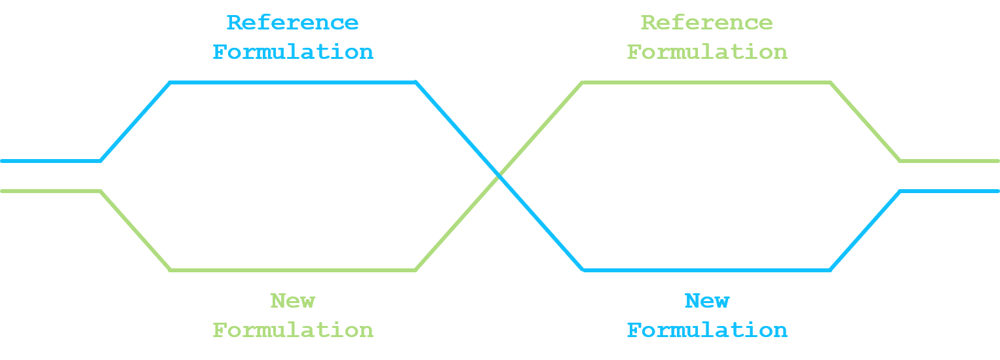

<script type="text/x-mathjax-config">
    MathJax.Hub.Config({ TeX: { equationNumbers: {autoNumber: "all"} } });
</script>
  
```{r setup, echo = FALSE, message = FALSE}

R_code_to_run <- 0 # if 1, run all simulations; 0 if not to run all simulations

directory <- 'G:/03_Projects/001_Website/jaeger-consulting.github.io/02_05_exnex_bioequivalence_R_codes/'

```

*Under construction*


# Robust exchangeability and bioequivalence studies

Let's consider that a reference drug formulation has already been evaluated in multiple clinical trials. Pharamacokinetic (PK) profile is considered to be established and information on the main PK parameters, like the area under the plasma concentation time curve ($AUC$), the peak drug concentration $C_{max}$ or the half-life $t_{1/2}$, is readily available.

Due to development constraints, like a modification of the manufacturing of the active ingredient, a process improvement for scaling-up the drug production or a new formulation to limit the food effect, a new formulation is to be evaluated for being used in all subsequent clinical trials.

Bioequivalence between the reference drug formulation and the new drug formulation is generally left to the judgment of the sponsor. According to the FDA guidance on bioavailability and bioequivalence for studies submitted in NDAs or INDs, *bioequivalence means the absence of a significant difference in the rate and extent to which the active ingredient or active moiety in pharmaceutical equivalents or pharmaceutical alternatives become available at the site of drug action when administered at the same molar dose under similar conditions in an appropriately designed study* (see definition in see @FDA2014).

This blog post will assess the impact of the robust exchangeability approach introduced by @Neuenschwander2016 when evaluating the average bioequivalence in a bioequivalence study. 

<br>


## 1. Proposed approach {#sec:proposed_approach}

<br>

### 1.1. Average bioequivalence

The most commonly used statistical design for comparing a new drug formulation and a reference drug formulation for average bioequivalence is a crossover design. At least two sequences and two periods have to be considered (standard 2x2 crossover design). In a standard 2x2 crossover design, each subject is randomized and assigned to a sequence of formulations. Subjects assigned to reference formulation/new formulation (R/N) will receive R in the first dosing period and N in the second dosing period. Subjects assigned to new formulation/reference formulation (N/R) will receive N in the first dosing period and R in the second dosing period. A sufficiently long washout period is to be imposed between the two dosing periods.

<center>
<div>

</div>
</center>

Given that PK parameters are (usually) log-normally distributed, log-transformation of exposure measures before statistical analysis is recommended [@FDA2001; @FDA2014].

Let $y_{n}$ be the log of $n$-th measure of the PK parameter, $n=1,\ldots,N$. The linear model under the 2x2 crossover design can be written as:

\begin{equation}
  y_{n} = \alpha_{f_{n}} + \beta \times p_{n} + \gamma \times c_{n} + \delta_{s_{n}} + \epsilon_{n}
  \label{eq:equation1}
\end{equation}


where:

- $f_{n}$ is the formulation indicator, i.e. $1$ or $2$ if the $n$-th observation is under the reference or new formulation;
- $p_{n}$ is the period covariate, i.e. $-1$ or $+1$ if the $n$-th observation is under the period 1 or period 2;
- $c_{n}$ is the carry-over covariate, i.e. $0$ if the $n$-th observation is under period 1, $-1$ if the $n$-th observation is under period 2 and the reference formulation or $+1$ if the $n$-th observation is under period 2 and the new formulation;
- $s_{n}$ is the subject indicator, i.e. the subject number associated with the $n$-th observation;
- $\alpha_{1}$ and $\alpha_{2}$ is the fixed effect for the reference formulation and the new formulation;
- $\beta$ is the period effect;
- $\gamma$ is the carry-over effect;
- $\delta_{s_{n}}$ is the random effect of the $s_{n}$-th subject, normally distributed with mean 0 and variance $\sigma_{s}^{2}$;
- $\epsilon_{n}$ is the random error in observing $y_{n}$, normally distributed with mean 0 and variance $\sigma_{\epsilon,f_n}^{2}$;
- the random effect and the random error are mutually independent.

The average bioequivalence will be stated if the 90% credible interval for $\alpha_{2} - \alpha_{1}$ is contained in the interval $\left[-\log\left(1.25\right); \log\left(1.25\right)\right]$.

<br>

### 1.2. Robust exchangeability

@Neuenschwander2016 have proposed a exchangeability–nonexchangeability (EXNEX) approach that can be seen as a robust mixture extension of the standard exchangeability approach. Each stratum-specific parameter can be exchangeable with other similar strata parameters or nonexchangeable with any of them.

The idea is to adapt this approach to the average bioequivalence setting and to apply the EXNEX approach on being under the reference drug formulation or the new drug formulation. For formulation $i$, the fixed effect $\alpha_{i}$ is modelled by:

- Exchangeability component, with probability $\pi_{i}$:
  * $\alpha_{i}|\mu_{\alpha},\tau_{\alpha} \sim \mathcal{N}\left(\mu_{\alpha},\tau_{\alpha}^{2}\right)$;
  * $\mu_{\alpha} \sim \mathcal{N}\left(m_{\alpha},t_{\alpha}^{2}\right)$;
  * $\tau_{\alpha} \sim \mathcal{HN}\left(0,\nu_{\alpha}^{2}\right)$;

- Non-exchangeability component, with probability $1 - \pi_{i}$:
  * $\alpha_{i} \sim \mathcal{N}\left(m_{\alpha_{i}},t_{\alpha_{i}}^{2}\right)$.

For the exchangeability distribution, parameters for the prior distributions for $\mu_{\alpha}$ and $\tau_{\alpha}$ will be constructed based on the available information from all the clinical trials where PK information is available on the reference drug formulation. For the non-exchangeable distribution, weakly informative prior could be envisaged. 
The probability $\pi_{i}$ can either be fixed and will be updated during the estimation process or a prior distribution can be set on it, e.g. $\pi_{i} \sim \mathcal{Be}\left(a_{i}, b_{i}\right)$. In both situation, it will indicate how a priori the reference/new drug formulations are exchangeable.

Supplementary material from @Neuenschwander2016 provides the WinBUGS [@Lunn2000] code for the binary EXNEX model. This can easily be updated to the 2x2 crossover linear model and over other software like Stan [@sdt2018].

<br>


## 2. Simulation

<br>

### 2.1. Simulation scenarios

In order to evaluate the characteristics for the proposed robust exchangeability approach versus alternative standard approaches, simulations will be performed over multiple scenarios.

The following models will be considered:

- Robust exchangeability approach presented in [Section 1](#sec:proposed_approach);
- Fully exchangeable approach for the prior for $\alpha_{i}$;
- Weakly informative approach for the prior for $\alpha_{i}$.

For the exchangeability distribution, it will not be discussed on how to set the parameters of the priors for $\mu_{\alpha}$ and $\tau_{\alpha}$. For the simulation, the followings is assumed:

- $\mu_{\alpha} \sim \mathcal{N}\left(xx,yy^2\right)$
- $\tau_{\alpha} \sim \mathcal{HN}\left(0,zz^2\right)$.

 The following data generation process will be considered:
 
 - Fixed effect for the reference formulation and the new formulation:
   * ;
   * ;
   * ;
   * ;
 - Period effect
 - Carry-over effect;
 - Standard deviation for the subject random effect;
 - Standard deviation for the random error;
 - Twelve (12), 16 or 20 subjects.

Per data generation scenario, 10'000 datasets will be generated. Power for average bioequivalence will be estimated as the proportion of cases where the 90% credible interval for $\alpha_{2} - \alpha_{1}$ is contained in the interval $\left[-\log\left(1.25\right); \log\left(1.25\right)\right]$.

<br>

## 2.2. Simulation results

<br>


## 3. Conclusion


When data generation aligned with prior, robust approach work similarly to the exchangeable approach
When data generation indicates average bioequivalence but is not aligned with the priors, robust approach works similarly to the weakly informative prior.
When data generation indicates no average bioequivalence, 

Discuss about the possibility to have easily adaptive feature and predictive probability decision.


<br>

<small>*Post created on 2020-12-DD. Last update on 2020-12-DD.*</small>

---

<br>

# References
<small>