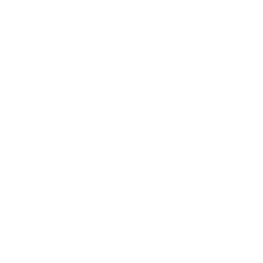

Jaeger Consulting proposes consulting services bringing seamlessly statistical innovation in early and late clinical development.

---

# Bayesian Approaches

<em>More on <a href="bayesian_approach.html">Bayesian Approaches</a></em>

---

# Adaptive Designs

<em>More on <a href="adaptive_design.html">Adaptive Designs</a></em>

---

# Quantitative Decision Making

<em>More on <a href="quantitative_decision_making.html">Quantitative Decision Making</a></em>

---

# Biometrics Services

<em>More on <a href="biometrics_services.html">Biometrics Services</a></em>

