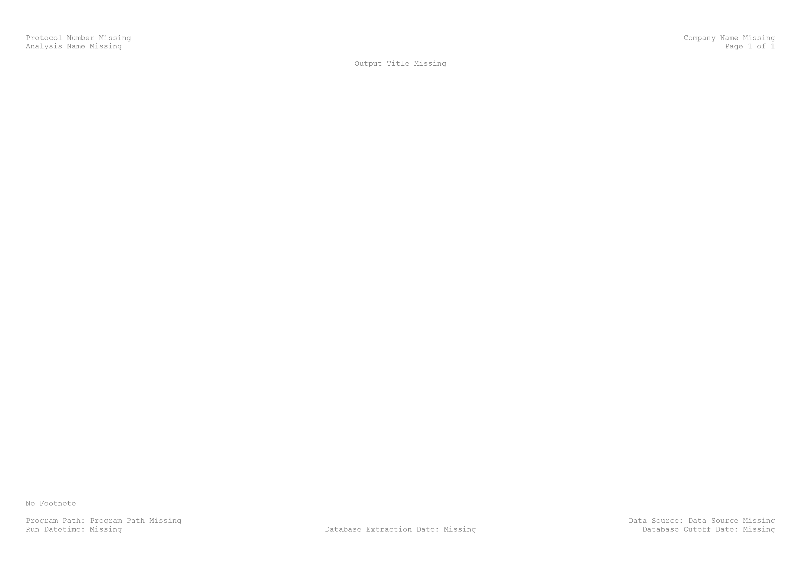

# Tables, figures and listings with R

R, combined with R Markdown [@Xie2018; @Allaire2020] and other packages, is an alternative for creating end-text tables, figures and listings for Section 14 and Section 16 of clinical study reports.

<br>

## 1. Setting up the project folder

### 1.1. Project folder

Before being able to produce any output, it is recommended to set up the project folder. In my case, I'm creating the project folder using RStudio. Version control is ensured using a git repository.

<br>

### 1.2. Connect your local repository with GitHub

If it is needed, the local repository can simply be connected with GitHub. Just create a personal token under <a href="https://github.com/settings/tokens">https://github.com/settings/tokens</a> and the function use_github from the package usethis.

<br>

## 2. Template for the table, figure or listing

The template called in the YAML metadata is the backbone of the table, figure or listing output. Both the formatting and the fields will play a key role in the production of the output.

<br>

### 2.1. Formating of the template

First of all, the formatting for the header, footer and main text zone of the template is to be chosen. In my case, the font is set at Courier New, style regular and size at 8pt. In addition, the spacing is set at 0 pt before and after each paragraph and with single line spacing within a paragraph.

<br>

### 2.2. Fields

The next important part is to specify fields that will contain the relevant information needed in the header and the footer. The followings is present in the header: protocol name, company name, analysis name, page numbering and the title of the output. For the footer, the followings is present: the footnotes, the program path, the data source, the run datetime, the database extraction date and the database cutoff date.

In the template, each of those information is a field. When the R Markdown will be knited, information from the YAML metadata will be used. In the image below, the text "Protocol Number Missing" is in fact the following field { IF "{ DOCPROPERTY ProtocolNumber }" = "Error! Unknown document property name." "Protocol Number Missing" "{ DOCPROPERTY ProtocolNumber }" }.

<center>
<div>

</div>
</center>

<br>

## 3. Creating the output using an R Markdown file

### 3.1 Setting up the YAML metadata

An R Markdown file, with default output set at Word document can now be created. The YAML metadata will inform the document properties of the output. In the below, the first 9 elements will be used for the header and the footer of the output. The last 3 elements are specifying that the output will be a Word document with the reference document being the template just created.

```{r eval=FALSE}
---
ProtocolNumber: "Wonderfull 1234"
CompanyName: "Jaeger Consulting"
AnalysisName: "Fake Analysis"
OutputTitle: "Table 14.3.1.3 Treatment-emergent Adverse Events (TEAEs) by Treatment and Total, per System Organ Class and Preferred Term (Safety Population)"
ProgramPath: "...//t_14_03_01_03.R"
DataSource: "ADSL, ADAE"
RunDatetime: "`r format(Sys.time(), '%Y-%m-%dT%H:%M')`"
DatabaseExtractionDate: "2020-04-23"
DatabaseCutoffDate: "2020-04-23"
output:
   word_document:
       reference_docx: './002_Appendix/Format/reference_styles_appendix.docx'
---
```

<br>

### 3.2 Working on the content of the ouput

The next steps are quite easy. It will just consists to create the R code to create the table, figure or listing of interest. Working with R Markdown will then ensure that the main content is within the body of the document.

In my case, I have was interested in creating a summary table for the treatment emergent adverse events by treatment and total, per the system organ class and preferred term. To do so, I have:

* downloaded the datasets adsl.xpt and adae.xpt available on the free repository <a href=https://bitbucket.cdisc.org/>https://bitbucket.cdisc.org/</a>;
* imported it in the environment of my R project using the function sasxport.get from the package Hmisc;
* worked on creating summary information (number of subjects with at least one event, percentage of subjects with at least one event and number of events) with standard ordering for adverse events summary tables;
* reported the table using the function flextable from the package flextable.

<br>

### 3.3 Knit to Word

Once the R Markdown file is ready, you can simply knit it using the shortcut Ctrl+Shift+K. In case the output is not expected to be created in the same folder than the R Markdown file, the function render from the package rmarkdown can be used.

The image below is a printscreen of the output created.

<center>
<div>

</div>
</center>

<br>

---

<br>

# References
<small>